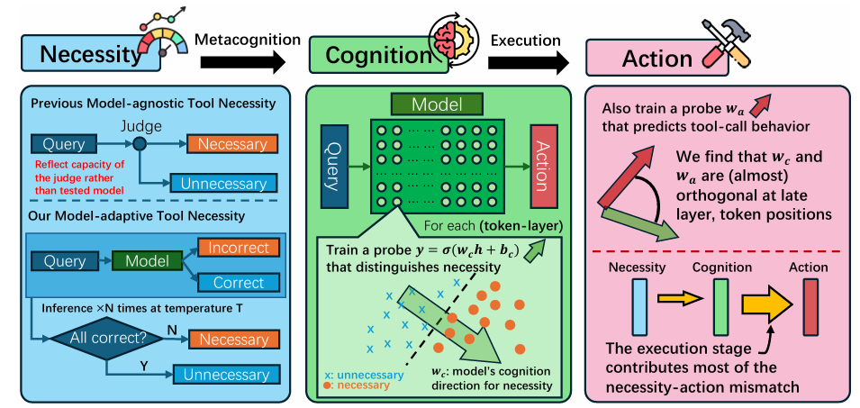

# Model-Adaptive Tool Necessity Reveals the Knowing-Doing Gap in LLM Tool Use

This repository contains the code and data used in the paper:
📄 [_Model-Adaptive Tool Necessity Reveals the Knowing-Doing Gap in LLM Tool Use_](https://github.com/chengez/Tool-Cognition-Action).

We study two linked questions in LLM-based agents:
(1) when should a model call external tools vs. answer directly, and
(2) when a model’s tool-use decisions deviate from the *model-adaptive* ground truth of when tools are actually needed, what drives that mismatch?




## 📖 Main Contributions and Findings:


1. **Model-Adaptive Tool Necessity**: We introduce the definition of tool necessity grounded in each model's *empirical performance*, rather than static, model-agnostic necessity annotations. A tool is necessary for a specific model if that model cannot reliably solve a query consistently without it. 

2. **Substantial Necessity-Action Mismatch**: Across four models (Llama-3.1-8B-Instruct, Llama-3.2-3B-Instruct, Qwen3-8B, Qwen3-4B) and two domains:
   - **Arithmetic**: 26.5–54.0% mismatch between when tools are truly needed and when models actually call them
   - **Factual QA (TruthfulQA)**: 30.8–41.8% mismatch

3. **Knowing-Doing Gap**: By decomposing tool-use into two stages (cognition and execution), we discover:
   - **Cognition Stage**: Models' internal representations often *contain* decodable signals about tool necessity
   - **Execution Stage**: These internal signals become **nearly orthogonal** to action representations in late layers
   - **Result**: Many errors originate from *failing to translate awareness into action* (cognition → action transition), not from lacking awareness itself


## 📁 Repository Structure
- `raw_data/`: Model-adaptive necessity labels and tool-call outcomes for each domain/model.
    - Each model/domain is split into four files: `necessary_called.json`, `necessary_Notcalled.json`, `unnecessary_called.json`, `unnecessary_Notcalled.json`.
    - Model generations (with/without tool calls) are saved as `necessary_{model}_outputs.json` and `unnecessary_{model}_outputs.json`.
    - “True necessity” is derived from empirical correctness: `metadata.correct_count == metadata.total_samples` (per sample set).
- `Inference/`: Inference and prompting code (adapted from [TicToc](https://github.com/chengez/TicToc)) used to collect models’ tool-calling behavior and produce the called / not-called splits.
- `format_input.py`: Converts raw OpenAI-style message histories into model-specific formatted prompts (chat template + tool specs).
- `extract_hidden_states.py`: Runs a HF causal LM and saves hidden-state vectors at chosen layers/positions into `clusters/`.
- `probe.py`: Trains simple linear probes to decode either **necessity** or **action** from saved hidden states.
- `position_spec.py`: Defines how token positions are specified (e.g., last token `-1` or pattern-based positions).

## ⚙️ Installation

We recommend creating a separate virtual or conda environment with python>=3.11, and then run:
```bash
pip install -r requirements.txt
```


## 🔄 Key Workflows

### Workflow 1: Formatting Model-Specific Input from Raw Data

**Purpose**: Convert raw data in OpenAI message format into model-specific formatted text with tool specifications.

**Example Command**:
```bash
python format_input.py \
    --raw_data raw_data/truthfulqa/Qwen3-4B/necessary_called.json \
    --model Qwen/Qwen3-4B \
    --output_dir data/truthfulqa
```

**Inputs**:
- `--raw_data`: JSON file containing `{"id": str, "history": list, "function": list}`
    - `history` is a list of chat messages (OpenAI-style `role`/`content`).
    - `function` is the list of available tools/function specs for that sample.
- `--model`: Model identifier (mapped to a handler in `Inference/inference/model_map.py`)

**Outputs**:
- JSON file with formatted queries ready for inference, named like:
    - `formatted-{raw_data_stem}-{model_basename}.json`

**What it does**:
1. Loads raw data with conversation history and available tools
2. Uses the model-specific handler to format the input (applies chat template, tool descriptions, etc.)
3. Saves formatted queries that preserve model-specific syntax requirements


### Workflow 2: Extracting Hidden States

**Purpose**: Extract activations from model hidden states at specified layers and token positions for probe training.

**Example command (single layer)**:
```bash
python extract_hidden_states.py \
    --model meta-llama/Llama-3.1-8B-Instruct \
    --dataset data/truthfulqa/formatted-necessary_called-Llama-3.1-8B-Instruct.json \
    --layer 30 \
    --position -1 \
    --output_dir clusters \
    --batch_size 8
```

**Example command (many layers in one run)**:
```bash
python extract_hidden_states.py \
    --model meta-llama/Llama-3.1-8B-Instruct \
    --dataset data/truthfulqa/formatted-necessary_called-Llama-3.1-8B-Instruct.json \
    --layers 1,2,3,4,5,6,7,8,9,10,11,12,13,14,15,16,17,18,19,20,21,22,23,24,25,26,27,28,29,30,31,32 \
    --position -1 \
    --output_dir clusters \
    --batch_size 8
```

**Key arguments**:
- `--dataset`: Path to the formatted JSON produced by Workflow 1
- `--model`: HF model name/path (e.g., `meta-llama/Llama-3.1-8B-Instruct`)
- `--layer` / `--layers`: Either a single integer layer index or a comma-separated list
    - Note: indexing follows HF `output_hidden_states`: `0` = embeddings, `1..N` = transformer blocks.
- `--position`: Token position spec (string). Commonly an integer like `-1` for the last token.
    - Advanced: can also be a pattern-based position (see `position_spec.py`) with `--token_offset` and `--occurrence`.
- `--output_dir`: Root output directory (default: `clusters`)
- `--batch_size`: Batch size for inference (adjust for GPU memory)

**Outputs**:
- One `.pt` file per extracted layer, saved under:
    - `clusters/{model_basename}/{data_name}/{raw_data_name}/...`
    - Filenames include the layer and position (e.g., `..._L30_K-1.pt`).

**What it does**:
1. Loads formatted queries
2. Runs models in inference mode with no gradient tracking
3. Extracts activations at the specified layer and token position
4. Saves one tensor per layer (shape `[num_samples, hidden_dim]`)

**Technical details**:
- Runs in batches to handle large datasets efficiently
- Uses padded batching + `output_hidden_states=True` and extracts per-example token positions
- Uses `max_length=2048` truncation during tokenization

---

### Workflow 3: Probing for Necessity and Action

**Purpose**: Train linear probes to decode (1) whether a tool is truly necessary and (2) whether the model will call a tool, from hidden states.

**Before running probes**:
- Ensure `clusters/` contains all four groups for the same `(model, data_name, position, layer)`:
    `necessary_called`, `necessary_Notcalled`, `unnecessary_called`, `unnecessary_Notcalled`.
    (In practice this means running Workflow 2 for each of the four formatted JSONs.)

**Example command**:
```bash
python probe.py \
    --model Llama-3.1-8B-Instruct \
    --data_name truthfulqa \
    --classification_type necessity \
    --use_pos_weight
```

**Probe Types**:
- `necessity`: Predict necessary vs. unnecessary (pooling across called + not-called)
- `action`: Predict called vs. not-called (pooling across necessary + unnecessary)

**Inputs**:
- `--model`: Model basename used in `clusters/` (e.g., `Llama-3.1-8B-Instruct`, `Qwen3-8B`)
- `--data_name`: Dataset name directory under `clusters/` (e.g., `truthfulqa`, `math_arithmetic_union`)
- `--classification_type`: `necessity` or `action`
- Optional: `--balance_clusters`, `--use_pos_weight`, `--seed`


**What it does**:
1. Loads hidden-state tensors from `clusters/` and constructs labels based on the 4-way split
2. Uses a 70/30 train/test split (per layer and per token position)
3. Trains a linear probe (single-layer MLP / logistic regression via `BCEWithLogitsLoss`)
4. Logs training and testing performance, and saves probe weights in `.npz` format.
    > These saved probe weights can be used to study the relationship between the necessity and action probes, as done in Section 5.3 of our paper.


## 📚 Citation

```bibtex
@article{cheng2026tool_cognition_action,
  title={Model-Adaptive Tool Necessity Reveals the Knowing-Doing Gap in LLM Tool Use},
  author={Cheng, Yize and Fan, Chenrui and JafariRaviz, Mahdi and Rezaei, Keivan and Feizi, Soheil},
  journal={arXiv preprint arXiv:2505.xxxx},
  year={2026}
}
```


